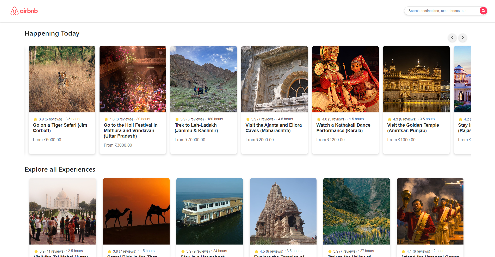
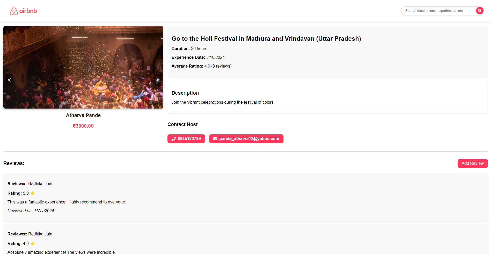
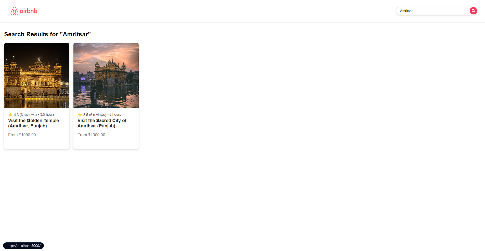
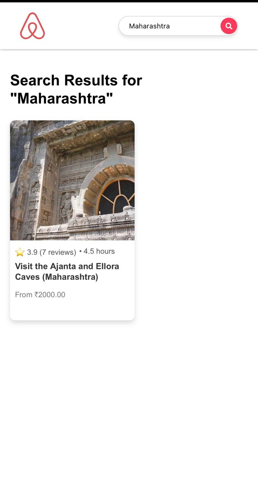

# Airbnb Experiences Clone

This is a responsive Airbnb website created using **React, NodeJS, MySQL, and Express**.

To run this project on your device:

### Setup:
1. **Clone the Repository:**
   ```bash
   git clone https://github.com/AnshulPatil29/WP-Airbnb-experiences-clone.git
   ```

2. **Navigate to the Project Directory:**
   ```bash
   cd WP-Airbnb-experiences-clone
   ```

3. **Install Root Dependencies (including `concurrently`):**
   ```bash
   npm install
   ```

4. **Install Dependencies for the Frontend:**
   ```bash
   cd frontend
   npm install
   ```

5. **Install Dependencies for the Backend:**
   ```bash
   cd ../backend
   npm install
   ```

6. **Navigate Back to the Project Root Directory:**
   ```bash
   cd ..
   ```

### Load Database:
1. **Install Required Libraries:**
   ```python
   pip install mysql pandas
   ```

2. **Configure Database Connection:**
   - In your database script, update the configuration details on **line 5:9** to match your database settings:
     ```python
     db_config = {
         'user': 'root',          # Replace with your MySQL username
         'password': 'password',  # Replace with your MySQL password
         'host': 'localhost',     # Replace with your host (e.g., localhost)
     }
     ```

3. **Configure Database in `backend/index.js`:**
   - Update the same configuration details in `backend/index.js` on **line 11:15**.

### Running the Project:
- **Start the Project**:
  ```bash
  npm start
  ```

### Project Features:

#### Desktop Layout
- **Home Page**:
  

- **Details Page**:
  

- **Search Feature**:
  

#### Mobile Layout
- **Home Page**:
  

- **Details Page**:
  

- **Search Feature**:
  

### Note:
* `concurrently` is set up to run both the backend and frontend upon executing `npm start`.
* **Known Issue:** The delete review button currently does not function as expected, and there are no plans for further updates.
